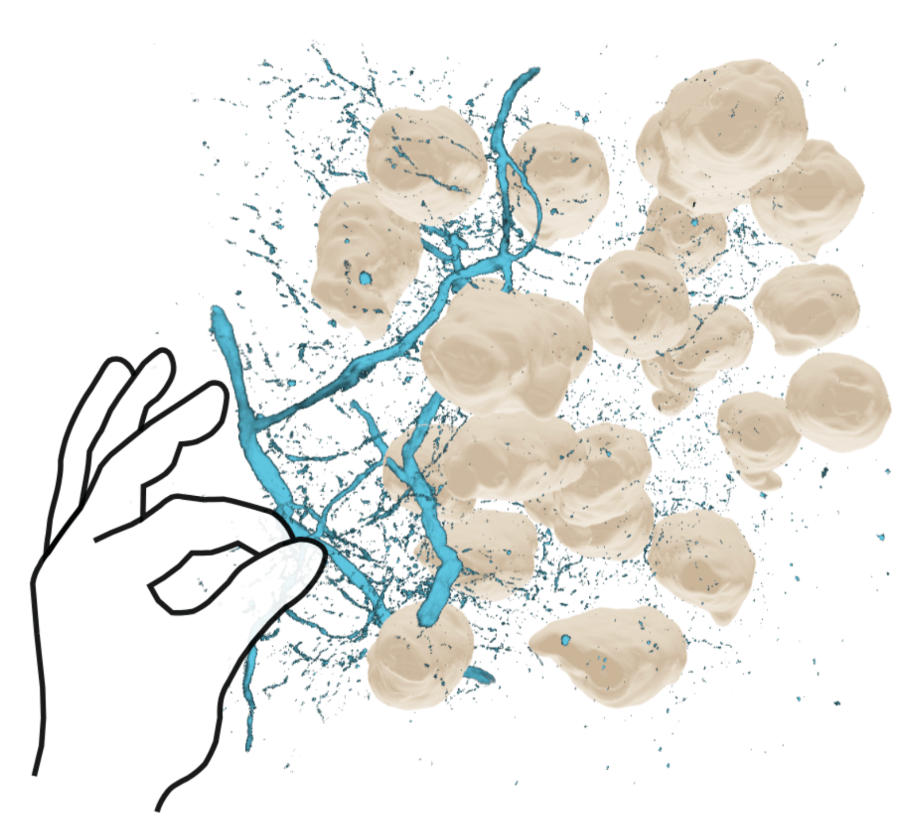

# Interactions within 3D Spatial View

You can now grab the 3D Volume by reaching out to it with **one hand** (left or right\!) and either pinching, or grabbing with a fist.

If the volume seems out of reach, reset the view, with an open hand, face your palm to your face and pinch your index finger and thumb together and hold it (You should see the meta menu icon ). See also [Meta documentation](https://www.meta.com/help/quest/articles/headsets-and-accessories/using-your-headset/recenter-headset-view/) on resetting your view.

To change Channel Settings you can still interact with Vitessce on your Desktop and it is synchronized with the 3D View. You will see the updates live.

