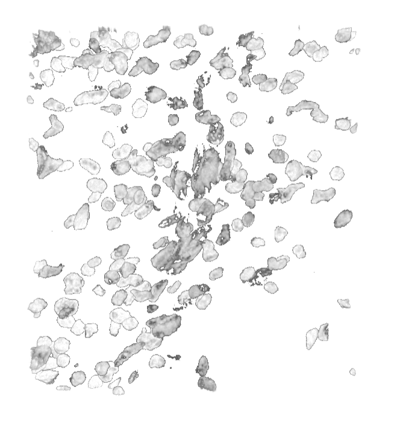

# Vitessce Link Tutorial with Sample Dataset

To load a 3D dataset first go to [vitessce.link/study](file:///Users/ericmoerth/Library/CloudStorage/GoogleDrive-eric.moerth@gmx.at/My%20Drive/HARVARD%20MEDICAL%20SCHOOL/Reviews/BioMedVis2024/vitessce.link/study) on your Desktop   

1) Enter your Team ID  
2) Enter a URL to your AWS hosted Dataset or try the Example  
3) Press Launch

You should now see a Vitessce instance with your data loaded  
In this view make sure that the **3D Mode** is activated  

Navigate to [vitessce.link](file:///Users/ericmoerth/Library/CloudStorage/GoogleDrive-eric.moerth@gmx.at/My%20Drive/HARVARD%20MEDICAL%20SCHOOL/Reviews/BioMedVis2024/vitessce.link) in the **Meta Quest Browser** in your Meta Quest 3 
<!-- TODO: Need to fix this link -->

1) Dial the 4 Digit Link ID that is displayed on your Desktop (in this example 1173\)  
2) Hit the  Button

This is the view you can now see in your Meta Quest 3  
To initiate the synchronization, move any slider in the Vitessce View on your Desktop (e.g. Channel Thresholds)

Now you should see Vitessce loading the dataset and synchronizing with the Desktop  
To start the Augmented Reality Experience press the **Enter AR** Button in your Meta Quest 3 **Meta Quest Browser** in the **Top Left**  

**You should now see the 3D Data floating in front of you\!**

**TIP:**  *If the Meta Quest 3 is unresponsive, you can simply restart it by holding the Power Button on the Goggles down for a few seconds until the screen goes black. (This doesn’t hurt the goggles)*
